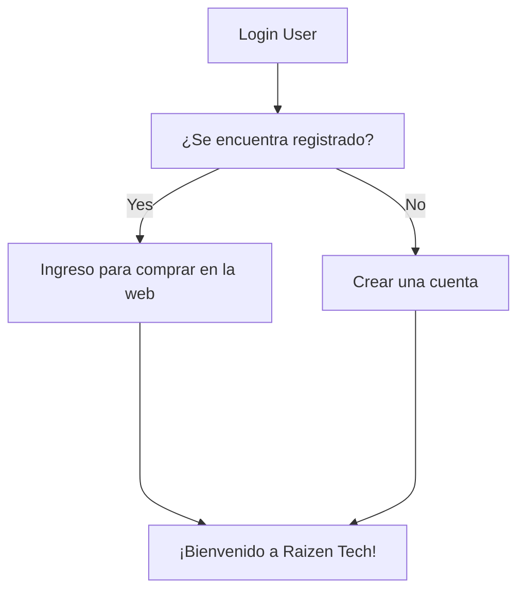

## Welcome to TechShop! 🧐
**Instalación:**

Se debe contar con VS Code para poder clonar el proyecto y contar con las extensiones de .net y C# para evitar posibles errores.

>Los mejores precios siempre!

### Introducción:

TechShop es una tienda de productos tecnológicos que busca digitalizar y automatizar su proceso de ventas mediante una plataforma online.

Algunos testimonios de nuestros clientes:
>Buen sitio. - **Franchesco Hernandez**

>Muy contenta con los equipos comprados a través de su sitio web. - **Rafaella Alcántara**

### Funcionalidades:

Raizen Tech presenta una interfaz agradable para el usuario, dinámica e interactiva. Entre ellas destacan el carrito de compras, registro y login.

##### Diagrama de flujo sencillo de login

### Prueba Online

Raizen Tech cuenta con un live demo disponible en https://link. Los usuarios pueden explorar la tienda en línea, agregar productos al carrito de compras y realizar compras de prueba.
